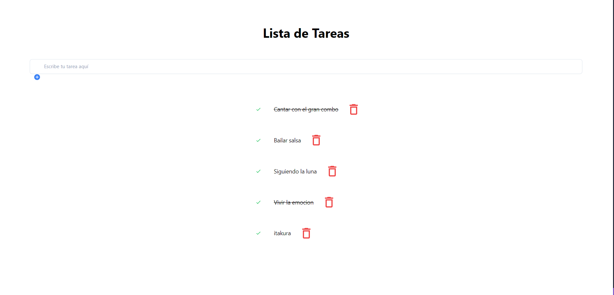

# Prueba Tecnica Creative Media

La presente es una aplicación MERN que es parte de la prueba técnica solicitada por Creative Media para el puesto de Web Developer.

Consiste en una aplicación de Lista de Tareas, con un input para ingresar las nuevas tareas, un botón para marcar la actividad como completada que tachará la actividad señalada y por último un botón que eliminará la tarea.

_Aplicación_



## Despliegue 📦

_Para el despligue del proyecto se utilizaron los siguientes servicios:_

* [Vercel](vercel.com) para el frontend
* [Railway](https://railway.app/) para el backend
* [MongoDb Atlas](https://www.mongodb.com/es/atlas/database) para la Base de Datos

 _[Aquí](https://heladitos-app.vercel.app/)_ puedes ver el proyecto completo

__

___


## Comenzando 🚀

_Para poder ejecutar el proyecto de forma local deberá crear los archivos .env en las carpetas /api y /client con la configuración necesaria de acuerdo a los archivos .env.example que hay en cada carpeta._


### Pre-requisitos 📋

_Se necesita estar registrado en el siguiente servicio para la ejecución del proyecto:_

* [Mongo Atlas](https://www.mongodb.com/es/atlas/database)

### Instalación 🔧

_Para ejecutar el proyecto de forma local se deberá navegar con el terminal dentro de las carpetas /client para el front y /api para el back, donde deberán seguir los siguientes pasos:_


_⌨️ Para instalar los servicios, navegar dentro de la carpeta correspondiente y ejecutar el comando_

```
npm install
```

_⌨️ Para ejecutarlo_

* En Frontend

        npm run dev

* En Backend

        npm start


_Finaliza con un ejemplo de cómo obtener datos del sistema o como usarlos para una pequeña demo_


## Construido con 🛠️

_Para la construcción de se utilizaron las siguientes tecnologías_

* [React](https://es.reactjs.org/) - Para generar las vistas.
* [ViteJS](https://vitejs.dev/) - Para generar el proyecto con React.
* [Tailwind CSS](https://tailwindcss.com/) - Para los estilos.
* [NodeJs](https://nodejs.org/en/) - Para la creación del server.
* [ExpressJs](https://expressjs.com/es/) - Para la creación del REST API.
* [MongoDB](https://www.mongodb.com/) - Para la Base de Datos.
* [Mongoose](https://mongoosejs.com/) - ORM para Mongo DB.
* [Mongo Atlas](https://www.mongodb.com/es/atlas/database) - Como host de nuestra Base de Datos.

## Autor ✒️

_Toda el funcionamiento y bugs del presente proyecto están a cargo de mí, más información la encuentran aquí:_

* **Rolando Quispe** - [Linkedin](https://www.linkedin.com/in/rolando-quispe/) - [Github](https://github.com/oxalc88)


---
⌨️ con ❤️ por [oxalc88](https://github.com/oxalc88) 😊
